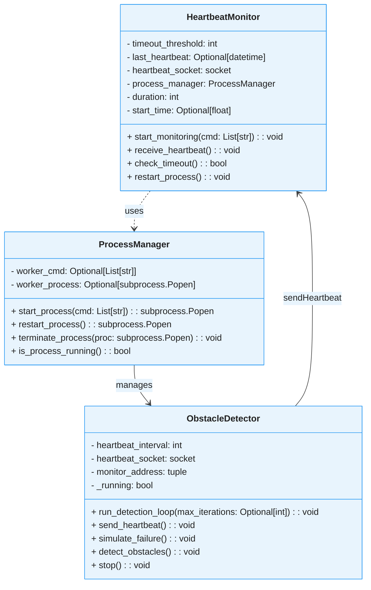
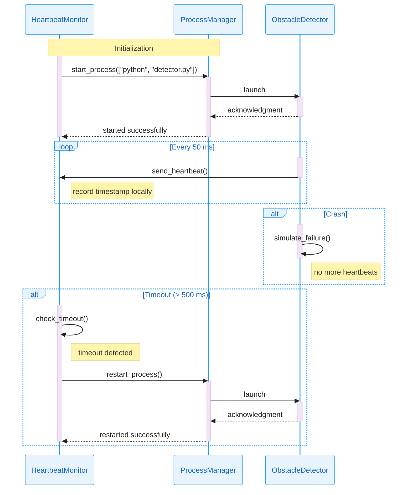

# 🚗💓 Heartbeat Obstacle Detector

[](https://codecov.io/gh/ajbarea/heartbeat-obstacle-detector) [](https://sonarcloud.io/summary/new_code?id=ajbarea_heartbeat-obstacle-detector)

A proof-of-concept implementation of the **Heartbeat** architectural tactic for fault detection and recovery, applied to an obstacle detection module in a self-driving car case study.

---

## 📋 Table of Contents

* [📖 Overview](#-overview)
* [🏗️ Architecture](#️-architecture)
* [📊 Class Diagram](#-class-diagram)
* [📈 Sequence Diagram](#-sequence-diagram)
* [💪 Architecture Strengths](#-architecture-strengths)
* [📡 UDP Communication](#-why-udp-for-heartbeats)
* [🔧 Components](#-components)
* [🚀 Installation](#-installation)
* [💻 Usage](#-usage)
* [📁 Project Structure](#-project-structure)

---

## 📖 Overview

This repository contains three Python scripts:

1. **🔍 detector.py**: Simulates an obstacle detection module that periodically sends heartbeat messages and randomly fails to mimic real-world crashes.
2. **👁️ monitor.py**: Listens for heartbeat messages from `detector.py` and coordinates fault detection and recovery.
3. **⚙️ process_manager.py**: Handles launching, monitoring, and restarting the detector process as part of the heartbeat fault detection system.

The purpose is to demonstrate how the Heartbeat tactic can detect faults and recover a critical sensing process in a distributed system.

---

## 🏗️ Architecture

* **🔍 Worker Process (`detector.py`)**: Sends a timestamped "alive" signal over UDP at regular intervals. Includes dummy obstacle distance outputs and random failure injection.
* **👁️ Monitor Process (`monitor.py`)**: Receives heartbeats, tracks timing, logs failures, and coordinates fault detection and recovery.
* **⚙️ Process Manager (`process_manager.py`)**: Handles launching, monitoring, and restarting the detector process as part of the heartbeat fault detection system.

---

## 📊 Class Diagram

The following class diagram shows the structure and relationships between the main components:



---

## 📈 Sequence Diagram

The following sequence diagram illustrates the heartbeat monitoring system flow:



---

## 💪 Architecture Strengths

This heartbeat-based fault detection system provides several key advantages:

**🔄 Automatic Recovery**: Detects process failures within 500ms and automatically restarts the obstacle detection module without manual intervention.

**🏗️ Modular Design**: Clean separation between monitoring, process management, and detection logic enables independent testing and maintenance.

**📡 Lightweight Communication**: UDP-based heartbeats minimize network overhead while providing timely fault detection.

**🛡️ Fault Isolation**: Process crashes are contained and don't affect the monitoring system, ensuring continuous supervision.

**⚡ Real-time Response**: 50ms heartbeat interval provides rapid fault detection suitable for safety-critical automotive applications.

---

## 📡 Why UDP for Heartbeats

In our self-driving car POC, UDP’s connectionless “fire-and-forget” design lets the obstacle detector send sub-millisecond heartbeats without TCP style handshakes, retransmits, or blocking.

**🚀 Ultra-Low Latency:** No connection setup or retransmit delays.

**📉 Minimal Overhead:** Lightweight datagrams cut bandwidth and CPU use.

**🔁 Stateless, Fire-and-Forget:** Missed packets merely indicate a failure—no blocking or retries.

**🌡️ Fault-Tolerant by Design:** Occasional loss is acceptable; the next heartbeat arrives almost immediately.

**⚙️ Simple Implementation:** Plain UDP sockets—no connection management or session state.

---

## 🔧 Components

* 🔍 `detector.py`
* 👁️ `monitor.py`
* ⚙️ `process_manager.py`
* 📦 `pyproject.toml`
* `README.md`
* 📁 `docs/` (Mermaid diagrams and documentation)
* 📁 `tests/` (Test files)

---

## 🚀 Installation

1. Clone the repository:

   ```bash
   git clone https://github.com/ajbarea/heartbeat-obstacle-detector.git
   cd heartbeat-obstacle-detector
   ```

2. Create and activate a virtual environment:

   ```bash
   python -m venv .venv
   source .venv/Scripts/activate  # Bash
   python -m pip install --upgrade pip
   pip install -e ".[dev]"
   ```

## 💻 Usage

1. Start the monitor process (it will spawn the detector):

    ```bash
    python src/monitor.py
    ```

2. Alternatively, you can run the detector standalone:

    ```bash
    python src/detector.py
    ```

3. The monitor will automatically launch the detector process and begin monitoring for heartbeats.

4. Observe logs for heartbeat reception and any detector restarts.

### Code Examples

**Basic Monitor Usage:**

```python
from src.monitor import HeartbeatMonitor

# Create monitor with 30-second duration
monitor = HeartbeatMonitor(duration=30)

# Start monitoring the detector process
detector_cmd = ["python", "src/detector.py"]
monitor.start_monitoring(detector_cmd)
```

**Basic Detector Usage:**

```python
from src.detector import ObstacleDetector

# Create and start detector
detector = ObstacleDetector()

# Run for 100 iterations then stop
detector.run_detection_loop(max_iterations=100)

# Or run indefinitely
# detector.run_detection_loop()
```

**Process Manager Usage:**

```python
from src.process_manager import ProcessManager

# Create process manager
pm = ProcessManager()

# Start a process
process = pm.start_process(["python", "src/detector.py"])

# Check if running
if pm.is_process_running():
    print("Process is running")

# Restart the process
pm.restart_process()

# Terminate when done
pm.terminate_process(process)
```

## 📁 Project Structure

```text
heartbeat-obstacle-detector/
├── src/
│   ├── detector.py                 # Obstacle detector with heartbeat
│   ├── monitor.py                  # Heartbeat monitor and fault detector
│   └── process_manager.py          # Process lifecycle management
├── tests/
│   ├── test_detector.py           # Unit tests for detector
│   ├── test_monitor.py            # Unit tests for monitor
│   └── test_process_manager.py    # Unit tests for process manager
├── docs/
│   ├── class.mermaid              # Class diagram source
│   ├── sequence.mermaid           # Sequence diagram source
│   └── software_architecture.md   # Detailed architecture docs
├── .github/
│   └── workflows/
│       └── ci.yml                 # GitHub Actions CI workflow
├── htmlcov/                       # Coverage reports (generated)
├── pyproject.toml                 # Project configuration and dependencies
├── README.md                      # This file
├── TODO.txt                       # Development todo list
├── lint.sh                        # Linting script for pre-commit hooks
├── .gitignore                     # Git ignore rules
└── .pre-commit-config.yaml        # Pre-commit hooks configuration
```
