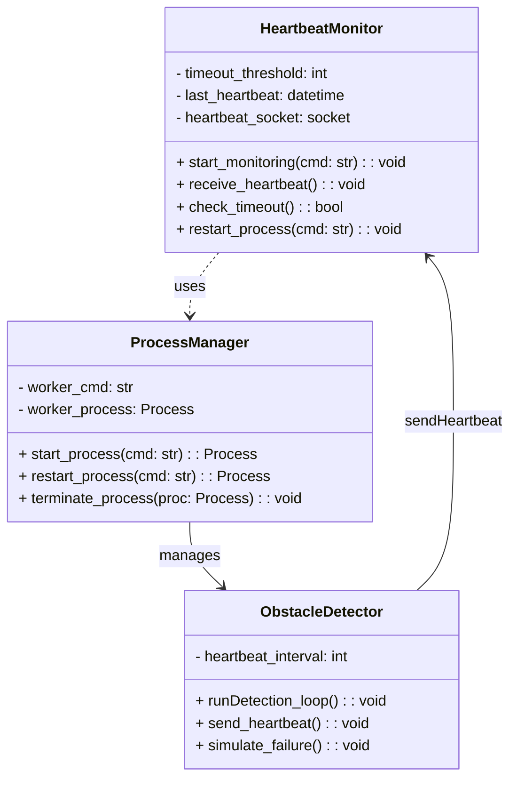
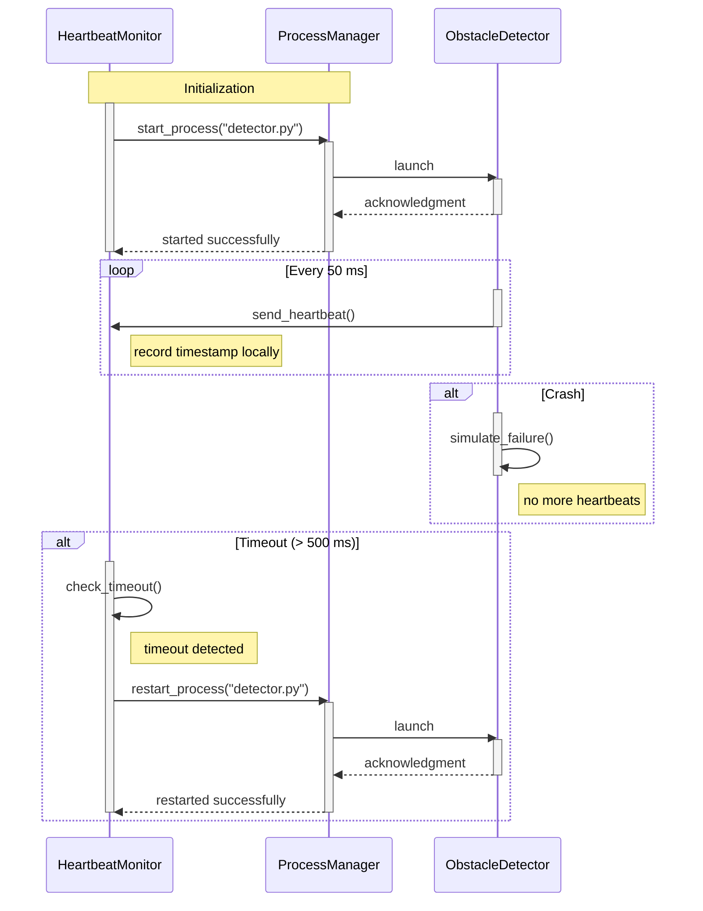

# Heartbeat Obstacle Detector

A proof-of-concept implementation of the **Heartbeat** architectural tactic for fault detection and recovery, applied to an obstacle detection module in a self-driving car case study.

---

## Table of Contents

* [Overview](#overview)
* [Architecture](#architecture)
* [Components](#components)
* [Prerequisites](#prerequisites)
* [Installation](#installation)
* [Usage](#usage)
* [Project Structure](#project-structure)

---

## Overview

This repository contains two Python scripts:

1. **detector.py**: Simulates an obstacle detection module that periodically sends heartbeat messages and randomly fails to mimic real-world crashes.
2. **monitor.py**: Listens for heartbeat messages from `detector.py` and restarts the detector if heartbeats stop.

The purpose is to demonstrate how the Heartbeat tactic can detect faults and recover a critical sensing process in a distributed system.

---

## Architecture

* **Worker Process (`detector.py`)**: Sends a timestamped "alive" signal over UDP at regular intervals. Includes dummy obstacle distance outputs and random failure injection.
* **Monitor Process (`monitor.py`)**: Receives heartbeats, tracks timing, logs failures, and respawns the worker process via Python's `subprocess` module.

---

## Class Diagram

The following class diagram shows the structure and relationships between the main components:



---

## Sequence Diagram

The following sequence diagram illustrates the heartbeat monitoring system flow:



---

## Components

* `detector.py`
* `monitor.py`
* `requirements.txt`
* `README.md`
* `docs/` (UML diagrams)

---

## Prerequisites

* Python 3.8 or newer
* (Optional) Virtual environment tool such as `venv` or `virtualenv`

---

## Installation

1. Clone the repository:

   ```bash
   git clone https://github.com/<your-username>/heartbeat-obstacle-detector.git
   cd heartbeat-obstacle-detector
   ```

2. (Optional) Create and activate a virtual environment:

   ```bash
   python3 -m venv venv
   source venv/bin/activate  # Linux/macOS
   venv\Scripts\activate     # Windows
   ```

3. Install dependencies:

   ```bash
   pip install -r requirements.txt
   ```

---

## Usage

1. Start the monitor process (it will spawn the detector):

   ```bash
   python monitor.py
   ```

2. Observe logs for heartbeat reception and any detector restarts.

---

## Project Structure

```text
heartbeat-obstacle-detector/
├── detector.py
├── monitor.py
├── requirements.txt
├── README.md
└── docs/
    ├── class-diagram.png
    └── sequence-diagram.png
```
