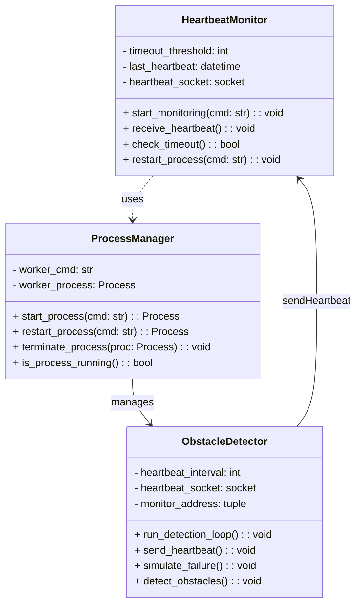
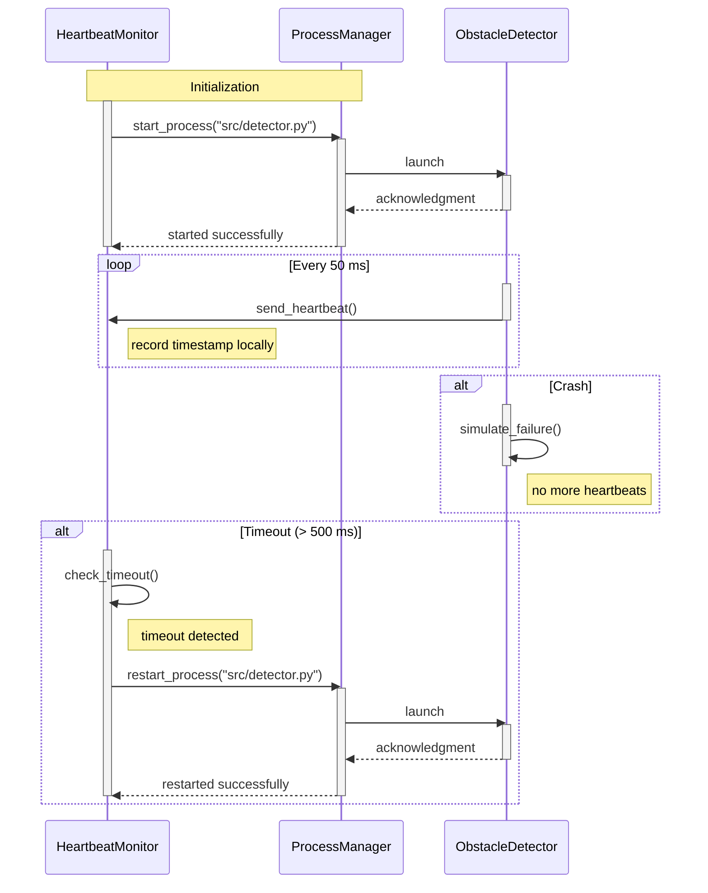

# 🚗💓 Heartbeat Obstacle Detector

A proof-of-concept implementation of the **Heartbeat** architectural tactic for fault detection and recovery, applied to an obstacle detection module in a self-driving car case study.

---

## 📋 Table of Contents

* [📖 Overview](#-overview)
* [🏗️ Architecture](#️-architecture)
* [Class Diagram](#class-diagram)
* [Sequence Diagram](#sequence-diagram)
* [Architecture Strengths](#architecture-strengths)
* [UDP Communication Benefits](#udp-communication-benefits)
* [🔧 Components](#-components)
* [🚀 Installation](#-installation)
* [💻 Usage](#-usage)
* [📁 Project Structure](#-project-structure)

---

## 📖 Overview

This repository contains three Python scripts:

1. **🔍 src/detector.py**: Simulates an obstacle detection module that periodically sends heartbeat messages and randomly fails to mimic real-world crashes.
2. **👁️ src/monitor.py**: Listens for heartbeat messages from `detector.py` and coordinates fault detection and recovery.
3. **⚙️ src/process_manager.py**: Handles launching, monitoring, and restarting the detector process as part of the heartbeat fault detection system.

The purpose is to demonstrate how the Heartbeat tactic can detect faults and recover a critical sensing process in a distributed system.

---

## 🏗️ Architecture

* **🔍 Worker Process (`detector.py`)**: Sends a timestamped "alive" signal over UDP at regular intervals. Includes dummy obstacle distance outputs and random failure injection.
* **👁️ Monitor Process (`monitor.py`)**: Receives heartbeats, tracks timing, logs failures, and coordinates fault detection and recovery.
* **⚙️ Process Manager (`process_manager.py`)**: Handles launching, monitoring, and restarting the detector process as part of the heartbeat fault detection system.

---

## Class Diagram

The following class diagram shows the structure and relationships between the main components:



---

## Sequence Diagram

The following sequence diagram illustrates the heartbeat monitoring system flow:



---

## Architecture Strengths

This heartbeat-based fault detection system provides several key advantages:

**🔄 Automatic Recovery**: Detects process failures within 500ms and automatically restarts the obstacle detection module without manual intervention.

**🏗️ Modular Design**: Clean separation between monitoring, process management, and detection logic enables independent testing and maintenance.

**📡 Lightweight Communication**: UDP-based heartbeats minimize network overhead while providing timely fault detection.

**🛡️ Fault Isolation**: Process crashes are contained and don't affect the monitoring system, ensuring continuous supervision.

**⚡ Real-time Response**: 50ms heartbeat interval provides rapid fault detection suitable for safety-critical automotive applications.

---

## UDP Communication Benefits

The system uses **UDP (User Datagram Protocol)** for heartbeat transmission, which offers specific advantages for fault detection:

**🚀 Low Latency**: No connection setup overhead enables sub-millisecond heartbeat transmission for real-time fault detection.

**📦 Minimal Overhead**: Lightweight protocol reduces network bandwidth usage and system resource consumption.

**🔥 Fire-and-Forget**: Heartbeats are sent without waiting for acknowledgments, preventing blocking in the detection loop.

**🎯 Perfect for Heartbeats**: Occasional packet loss is acceptable since the next heartbeat arrives within 50ms.

**🌐 Simple Implementation**: Straightforward socket programming without complex connection management or state tracking.

---

## 🔧 Components

* 🔍 `src/detector.py`
* 👁️ `src/monitor.py`
* ⚙️ `src/process_manager.py`
* 📦 `pyproject.toml`
* 📦 `requirements.txt`
* 📖 `README.md`
* 📁 `docs/` (Mermaid diagrams and documentation)
* 📁 `tests/` (Test files)

---

## 🚀 Installation

1. Clone the repository:

   ```bash
   git clone https://github.com/ajbarea/heartbeat-obstacle-detector.git
   cd heartbeat-obstacle-detector
   ```

2. Create and activate a virtual environment:

   ```bash
   python -m venv .venv
   source .venv/Scripts/activate  # Bash
   python -m pip install --upgrade pip
   pip install -e ".[dev]"
   ```

## 💻 Usage

**Note**: This is currently a proof-of-concept with skeleton implementation. The core functionality is not yet complete.

1. Once implemented, start the monitor process (it will spawn the detector):

    ```bash
    python src/monitor.py
    ```

2. The monitor will automatically launch the detector process and begin monitoring for heartbeats.

3. Observe logs for heartbeat reception and any detector restarts (when fully implemented).

## 📁 Project Structure

```text
heartbeat-obstacle-detector/
├── src/
│   ├── detector.py
│   ├── monitor.py
│   └── process_manager.py
├── tests/
│   └── .gitkeep
├── docs/
│   ├── class.mermaid
│   ├── sequence.mermaid
│   └── Fault-Detection Using Heartbeat Tactic.pdf
├── pyproject.toml
├── requirements.txt
├── README.md
└── .gitignore
```
