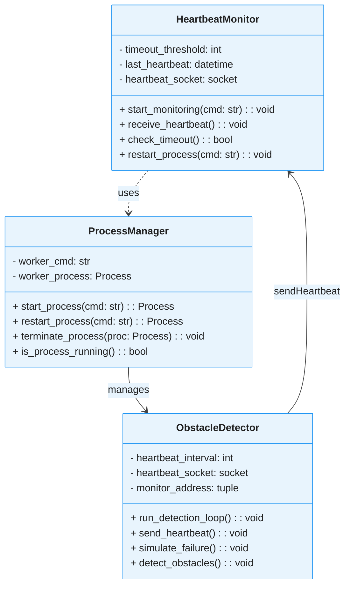
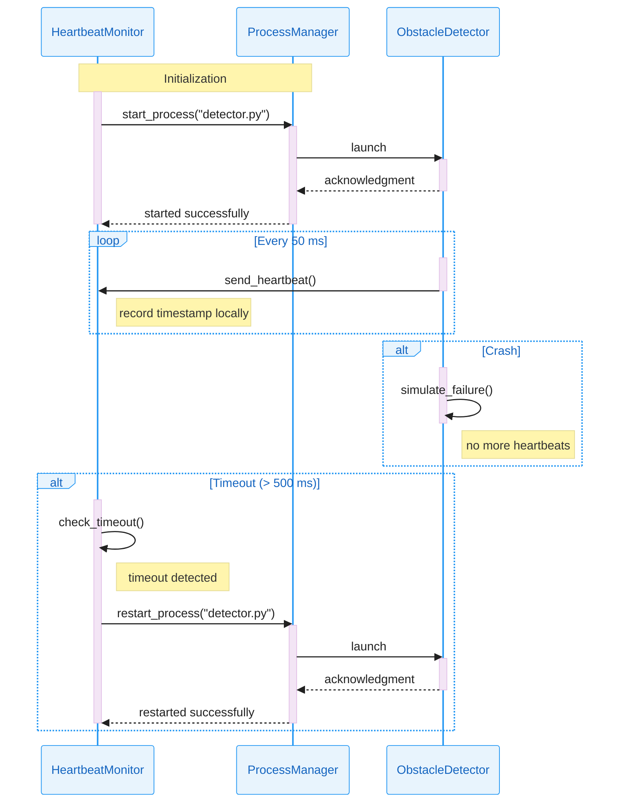

# Software Architecture

## 📋 Table of Contents

- [Class Diagram](#class-diagram)
- [Sequence Diagram](#sequence-diagram)

<!-- ## Theme Configuration

For consistency across all diagrams, use this configuration block at the start of each Mermaid diagram:

```javascript
%%{init: {
  "theme": "base",
  "themeVariables": {
    "primaryColor": "#E8F4FD",
    "primaryBorderColor": "#2196F3",
    "primaryTextColor": "#1565C0",
    "secondaryColor": "#F3E5F5",
    "secondaryBorderColor": "#9C27B0",
    "secondaryTextColor": "#6A1B9A",
    "tertiaryColor": "#E8F5E8",
    "tertiaryBorderColor": "#4CAF50",
    "tertiaryTextColor": "#2E7D32",
    "lineColor": "#424242",
    "background": "#FAFAFA",
    "textColor": "#212121",
    "nodeTextColor": "#1565C0",
    "edgeLabelBackground": "#FFFFFF",
    "clusterBkg": "#F5F5F5",
    "clusterBorder": "#BDBDBD",
    "fillType0": "#E3F2FD",
    "fillType1": "#F3E5F5",
    "fillType2": "#E8F5E8",
    "fillType3": "#FFF3E0",
    "fillType4": "#FCE4EC",
    "fillType5": "#F1F8E9",
    "fillType6": "#E0F2F1",
    "fillType7": "#FFF8E1"
  }
}}%%
``` -->

## Class Diagram



## Sequence Diagram


